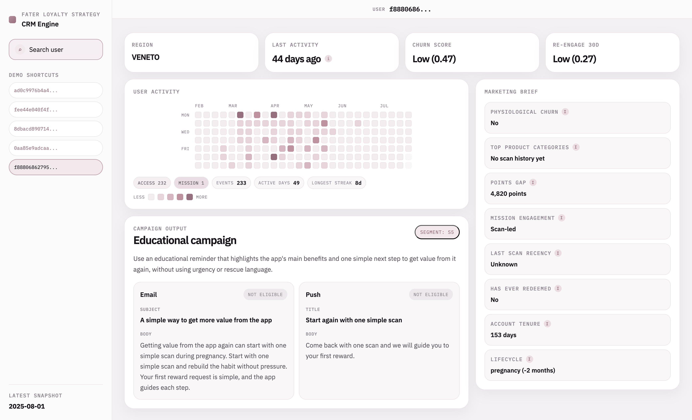

# LUISS Grand Challenge: Fater Loyalty Strategy

This repository contains an end-to-end CRM decision system for Fater's loyalty ecosystem. It combines raw data preparation, exploratory analysis, predictive modeling, user segmentation, campaign recommendations, and a demo interface that makes the final decision logic inspectable. The project is built around one practical question:

> Given what we know about a user on a reference date, what is the right loyalty action to take next?

Rather than treating that as a single churn-only modeling task, the repository implements a broader propensity framework with two complementary predictive targets, a business rule layer, and a presentation layer that makes the final recommendation reviewable end to end.

**Project Members**

- Mattia Galentino
- Maiia Kopalina
- Riccardo Palleschi
- Luka Burmazevic

## Overview

Fater's loyalty base is not homogeneous. Users differ by lifecycle stage, recent activity, reward proximity, channel eligibility, product interests, and likelihood of responding to a campaign. The project therefore treats loyalty strategy as two connected CRM decisions: which users are at real risk of fading out and need a retention action, and which users are still warm enough to be pushed toward stronger engagement. Lifecycle is treated as context rather than a target on its own, because some churn-like behavior is physiological and should not automatically trigger a rescue campaign.

**Solution.**

The solution is one coordinated CRM decision engine built on top of two propensity models.
`churn_30_to_60` estimates the probability that a user currently inactive for 30 to 59 days remains inactive for the next 30 days, while `re_engage_30d` estimates the probability that a user records at least one meaningful event such as a `scan`, `mission`, or `redeem` in the next 30 days.

## Approach

The project uses user profile data, app interactions, uploaded codes and points behavior, mission participation, reward history, and product master data to recover category preferences from scan history. On top of those sources, it enriches the analysis with external ISTAT regional context.

Several patterns matter for the final CRM design. Most of the observable signal comes from recurring access, scan, and mission behavior; activity level changes over time, which makes temporal validation more appropriate than a pooled random split; points are highly concentrated, so reward proximity becomes a useful CRM lever; and lifecycle stage affects message relevance, especially near late-stage transitions.

The final output is a campaign framework. Each segment maps to a distinct CRM direction:

| Segment                                     | Campaign Direction         | CRM Goal                                                                        |
| ------------------------------------------- | -------------------------- | ------------------------------------------------------------------------------- |
| `S1` Lifecycle-transition churn             | Referral-led exit campaign | Convert likely lifecycle exit into referral value rather than forcing retention |
| `S2` High-churn rescue                      | Double-points rescue       | Intervene quickly on preventable high-churn users                               |
| `S3` Low-churn, reward-near                 | Prize reminder             | Push conversion when reward distance is already small                           |
| `S4` Low-churn, high-engagement, reward-far | Incentive acceleration     | Deepen engagement for healthy users who still need a stronger hook              |
| `S5` Low-churn, low-engagement, reward-far  | Educational campaign       | Remind users of the app's benefits and easy ways to get value again             |

## Results

By the end of the workflow, the repository produces exploratory analysis and charts, a reusable training artifact with cleaned tables, events, features, and labels, validation outputs for both models, scored user-level CSV exports for all months and for the latest month, a rule-based CRM decision layer, and a browser demo for inspecting one user at a time.

The project runs in four stages. First, `eda.ipynb` loads the local datasets, cleans and harmonizes them, builds the user base, creates the event history, and writes the shared snapshot artifact. Second, `final.ipynb` reads that artifact, trains the two logistic-regression propensities with temporal validation, benchmarks them against random forest, checks calibration, and exports score tables. Third, `decision_rules.txt` defines the final first-match-wins CRM segmentation logic. Finally, `web/` loads the exported artifacts and serves a demo that shows the user profile, activity heatmap, CRM segment, and message brief.

**Model snapshot.**

The current exported validation metrics in `artifacts/final/validation_metrics.csv` are:

| Model     |   Rows | Positive Rate | ROC AUC | Average Precision | Top-Decile Precision |
| --------- | -----: | ------------: | ------: | ----------------: | -------------------: |
| Churn     |  1,251 |        0.6563 |  0.7977 |            0.8759 |               0.9444 |
| Re-engage | 19,115 |        0.3813 |  0.9635 |            0.9229 |               0.9582 |

The churn model is useful for ranking risky users and produces calibrated probabilities that are suitable for downstream CRM decisions. Re-engagement is still the stronger task overall and performs very well on both ranking and precision. Logistic regression remains the default because it is stable, interpretable, and easy to connect to the downstream CRM rule layer.

## Repository Guide

| Path                 | Role In The Project                                                                                                                                                           |
| -------------------- | ----------------------------------------------------------------------------------------------------------------------------------------------------------------------------- |
| `eda.ipynb`          | Builds the analytical foundation of the project: it cleans the raw data, explores the user base, engineers the main features, and writes the shared artifact used downstream. |
| `final.ipynb`        | Trains and evaluates the two propensity models, checks their performance, and exports the scoring outputs that feed the CRM decision layer.                                   |
| `decision_rules.txt` | Defines the business rules that convert model signals into the final CRM segments and campaign recommendations.                                                               |
| `web/`               | Contains the demo app that loads the exported artifacts and shows the final decision logic through a browsable interface.                                                     |
